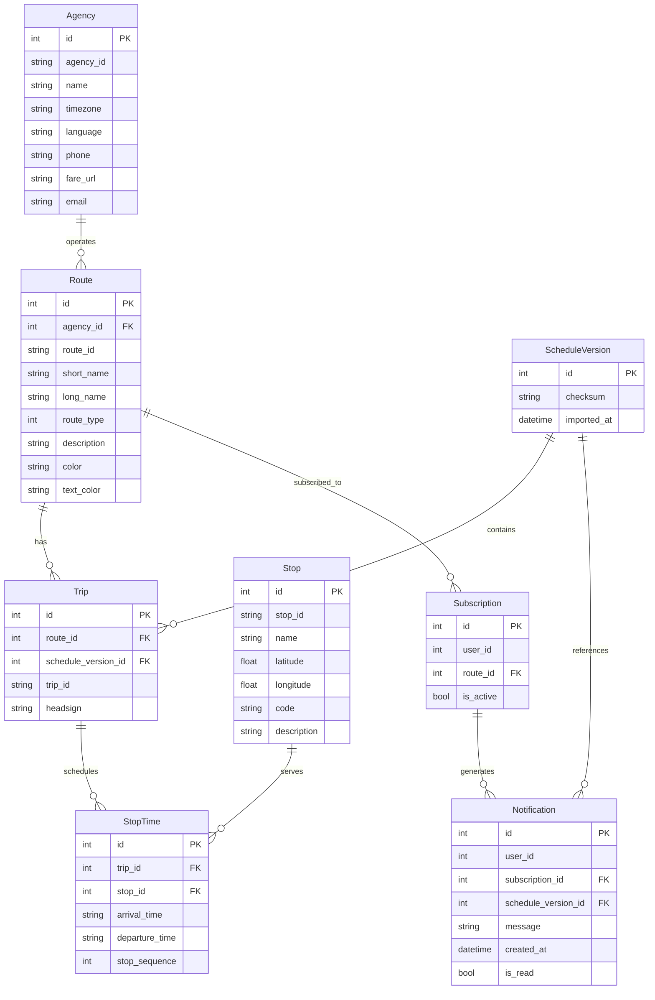

```mermaid
erDiagram

    Agency ||--o{ Route : operates
    ScheduleVersion ||--o{ Trip : contains
    Route ||--o{ Trip : has
    Trip ||--o{ StopTime : schedules
    Stop ||--o{ StopTime : serves

    Route ||--o{ Subscription : subscribed_to
    Subscription ||--o{ Notification : generates
    ScheduleVersion ||--o{ Notification : references

    Agency {
        int id PK
        string agency_id
        string name
        string timezone
        string language
        string phone
        string fare_url
        string email
    }

    Route {
        int id PK
        int agency_id FK
        string route_id
        string short_name
        string long_name
        int route_type
        string description
        string color
        string text_color
    }

    Trip {
        int id PK
        int route_id FK
        int schedule_version_id FK
        string trip_id
        string headsign
    }

    Stop {
        int id PK
        string stop_id
        string name
        float latitude
        float longitude
        string code
        string description
    }

    StopTime {
        int id PK
        int trip_id FK
        int stop_id FK
        string arrival_time
        string departure_time
        int stop_sequence
    }

    Subscription {
        int id PK
        int user_id
        int route_id FK
        bool is_active
    }

    Notification {
        int id PK
        int user_id
        int subscription_id FK
        int schedule_version_id FK
        string message
        datetime created_at
        bool is_read
    }

    ScheduleVersion {
        int id PK
        string checksum
        datetime imported_at
    }
```
